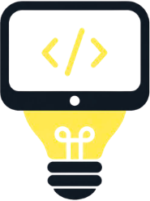

# MakeASof - Gerador de Software para Leigos

  

## 🚀 Sobre o Projeto

O **MakeASof** (Make A Software) é uma plataforma inovadora com a proposta de ser um **gerador de software para leigos**. Através de uma interface conversacional intuitiva e ferramentas assistidas por IA, qualquer pessoa, independente de seu conhecimento técnico, pode criar seus próprios aplicativos e sistemas.

O grande diferencial do MakeASof não é apenas gerar código, mas garantir que o usuário **entenda o que está sendo construído**. Queremos desmistificar a criação de software e colocar o poder do desenvolvimento nas mãos de todos.

## 🧠 Foco na Compreensão (O "Prompter" no Controle)

Sabemos que gerar um software complexo pode ser avassalador para quem não tem familiaridade com programação. Por isso, implementamos mecânicas para garantir que o "prompter" (o usuário que está guiando a IA) não se perca no processo:

- **Relatórios e Glossários a cada Marco:** A cada novo marco (milestone) ou funcionalidade importante do projeto gerado, o MakeASof fornece um **relatório detalhado e um glossário geral do sistema**. Isso explica em linguagem simples o que foi feito, como as partes se conectam e o significado dos termos técnicos envolvidos.
- **Gamificação do Aprendizado (Quiz):** Para os usuários que desejam uma abordagem mais interativa e gamificada, o sistema pode gerar automaticamente um **Quiz com 10 questões fundamentais** sobre o escopo do projeto e as tecnologias adotadas até aquele momento. Responder às questões garante que o usuário compreendeu as fundações do seu próprio software antes de avançar para etapas mais complexas.

## 🎨 Identidade Visual

O design do MakeASof utiliza a seguinte paleta de cores para uma interface moderna e acessível:
- `#0d1b2a` (Rich Black)
- `#1b263b` (Oxford Blue)
- `#415a77` (YinMn Blue)
- `#778da9` (Silver Lake Blue)
- `#e0e1dd` (Platinum)

## 🎯 Por que o MakeASof é diferente?

1. **Acessibilidade Absoluta:** Focado inteiramente em quem não sabe programar.
2. **Transparência e Educação:** Você não apenas recebe um produto pronto, você entende como ele funciona.
3. **Validação Contínua:** Os relatórios e quizzes garantem que a visão do usuário e o que a IA está construindo permaneçam alinhados.

---
*Construa sua ideia. Entenda o processo. MakeASof.*
